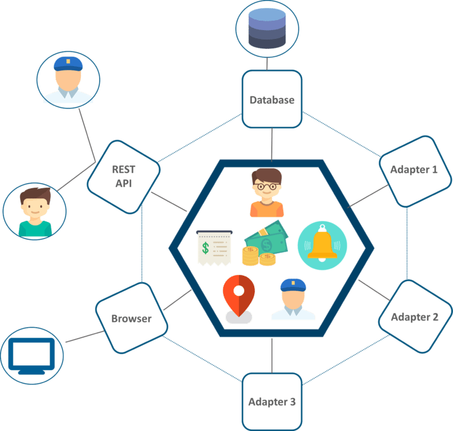
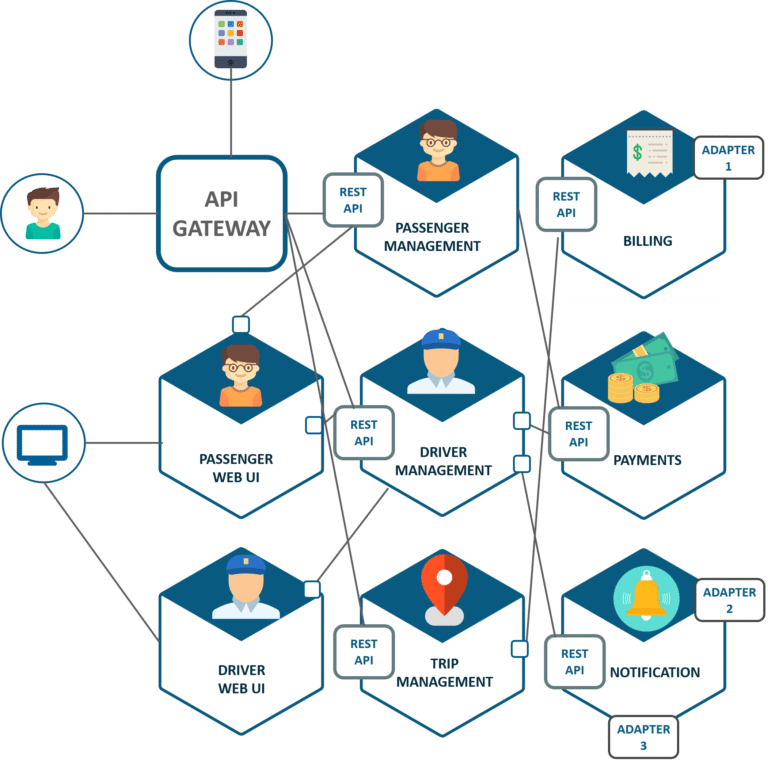

# Microservices Basic Training 02

## Microservice Case Study:
####Explore UBER’s Microservice Architecture1

UBER’s Previous Architecture

Like many startups, UBER began its journey with a monolithic architecture built for a single offering in a single city. Having one codebase seemed cleaned at that time, and solved UBER’s core business problems. However, as UBER started expanding worldwide they rigorously faced various problems with respect to scalability and continuous integration.

The above diagram depicts UBER’s previous architecture.

- A REST API is present with which the passenger and driver connect.
- Three different adapters are used with API within them, to perform actions such as billing, payments, sending emails/messages that we see when we book a cab.
- A MySQL database to store all their data.

So, if you notice here all the features such as passenger management, billing, notification features, payments, trip management, and driver management were composed within a single framework.

####Problem Statement

While UBER started expanding worldwide this kind of framework introduced various challenges. The following are some of the prominent challenges
- All the features had to be re-built, deployed and tested again and again to update a single feature.
- Fixing bugs became extremely difficult in a single repository as developers had to change the code again and again.
- Scaling the features simultaneously with the introduction of new features worldwide was quite tough to be handled together.

#### Solution

To avoid such problems UBER decided to change its architecture and follow the other hyper-growth companies like Amazon, Netflix, Twitter and many others. Thus, UBER decided to break its monolithic architecture into multiple codebases to form a microservice architecture.

Refer to the diagram below to look at UBER’s microservice architecture.

- The major change that we observe here is the introduction of API Gateway through which all the drivers and passengers are connected. From the API Gateway, all the internal points are connected such as passenger management, driver management, trip management, and others.
- The units are individual separate deployable units performing separate functionalities.

For Example: If you want to change anything in the billing Microservices, then you just have to deploy only billing Microservices and don’t have to deploy the others.

- All the features were now scaled individually i.e. The interdependency between each and every feature was removed.

For Example, we all know that the number of people searching for cabs is more comparatively more than the people actually booking a cab and making payments. This gets us an inference that the number of processes working on the passenger management microservice is more than the number of processes working on payments.

In this way, UBER benefited by shifting its architecture from monolithic to Microservices.

#### Next steps
Now that we have a business context and understand the basics to move from a monolith to a microservice approach, lets start to implement the following microservices:
- Passenger management ([04_passenger_management](../04_passenger_management))
- Driver management ([05_drive_management](../05_driver_management))
- Trip management ([06_trip_management](../06_trip_management))

References:

 1. This case study was taken from [Sahiti Kappagantula's Article](https://medium.com/edureka/microservice-architecture-5e7f056b90f1)
